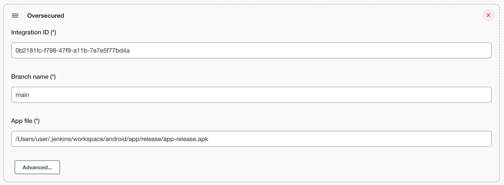
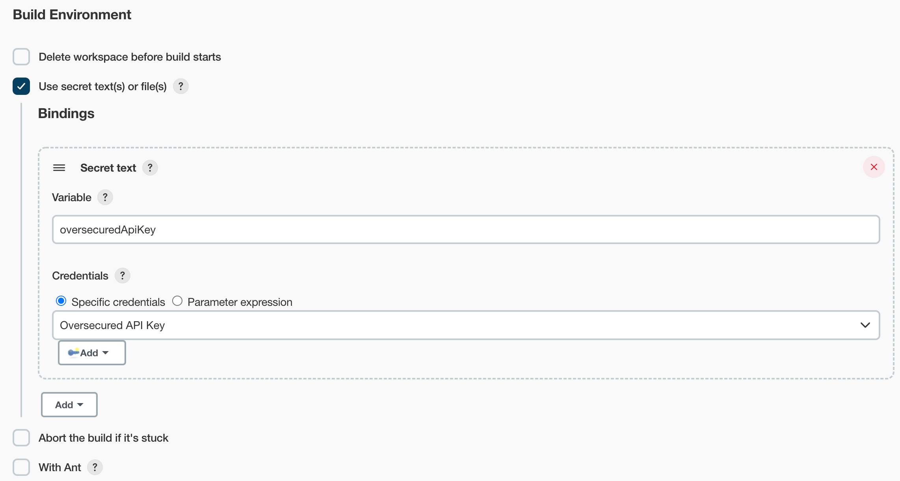

# Oversecured Plugin for Jenkins

Enterprise vulnerability scanner for Android and iOS apps. It offers app owners and developers the ability to secure each new version of a mobile app by integrating Oversecured into the development process.

## Getting started

1. [Create an Integration](https://oversecured.com/docs/quick-start/) and [generate an API Key](https://oversecured.com/settings/api-keys)
2. Build the plugin `mvn clean install`
3. Add it to the plugins list `cp target/oversecured.hpi ~/.jenkins/plugins/`
4. Add the plugin to your pipeline 
5. Specify your Integration ID, Branch name and output app file location 
6. Add your Oversecured API Key to Jenkins Credentials 
7. In your project configuration, bind the created secret value to the `oversecuredApiKey` variable 
6. Now it's ready to use! 

## LICENSE

Licensed under MIT, see [LICENSE](LICENSE.md)

